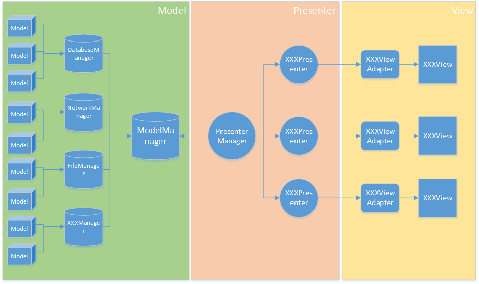

# EasyAndroid

Make the android development to be easy.

It's still coding, please wait...
2015-12-22：I would be busy,so this project would be stopped a few days.But I never give up.I'll back. :)

# Design Thinking Of EasyAndroid

## EasyAndroid-Base module

The base module to provide any base tools for other modules：

1. Log tools.
2. SharePreferences tools.
3. Parse tools to parse value between native type and string.
4. Image tools.

## EasyAndroid-Bluetooth module

The bluetooth module to provide any bluetooth controller.It's base on fragment without view.

## EasyAndroid-Cache module

## EasyAndroid-DataBase module

## EasyAndroid-Injection module

A view injected tools.No like annotation injection, it's should be injected manually.

## EasyAndroid-Network module

## EasyAndroid-UI module

## EasyAndroid-Container module

This is a android MVP framework.There framework should like:

1. Model: represent the target detail data struct.
2. XXXModelManager: The Model factory, just like NetworkModelManager, DataBaseModelManager, FileModelManager and so on, which will create or find the target model by their way.
3. ModelManager: It should be a model factory manager.That's meaning it include any real XXXModelManagers.
4. Presenter: provide any data apis for "view" or "view adapter", and the controlling logic.
5. PresenterManager: A presenter manager.All presenters should be push to PresenterManager, and then the PresenterManager will execute the controlling logic which defined in presenter.Other side, PresenterManager also provide connection to ModelManager.
6. View: It's a fragment.
7. ViewAdapter: It's a adapter between "View" and Presenter.

## EasyAndroid module

The module contain all other module.

# License

    Copyright 2015 Jianan - qinxiandiqi@foxmail.com

    Licensed under the Apache License, Version 2.0 (the "License");
    you may not use this file except in compliance with the License.
    You may obtain a copy of the License at

      http://www.apache.org/licenses/LICENSE-2.0

    Unless required by applicable law or agreed to in writing, software
    distributed under the License is distributed on an "AS IS" BASIS,
    WITHOUT WARRANTIES OR CONDITIONS OF ANY KIND, either express or implied.
    See the License for the specific language governing permissions and
    limitations under the License.