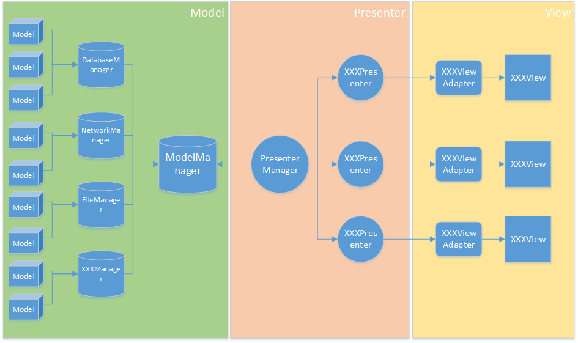

# Design Thinking Of EasyAndroid

## EasyAndroid-Base

The base module to provide any base tools for other modules：

1. Log tools.
2. SharePreferences tools.
3. Parse tools to parse value between native type and string.
4. Image tools.

## EasyAndroid-Bluetooth

The bluetooth module to provide any bluetooth controller.It's base on fragment without view.

## EasyAndroid-Cache

## EasyAndroid-DataBase

## EasyAndroid-Injection

A view injected tools.No like annotation injection, it's should be injected manually.

## EasyAndroid-Network

## EasyAndroid-UI

## EasyAndroid-Container

This is a android MVP framework.There framework should like:

1. Model: represent the target detail data struct.
2. XXXModelManager: The Model factory, just like NetworkModelManager, DataBaseModelManager, FileModelManager and so on, which will create or find the target model by their way.
3. ModelManager: It should be a model factory manager.That's meaning it include any real XXXModelManagers.
4. Presenter: provide any data apis for "view" or "view adapter", and the controlling logic.
5. PresenterManager: A presenter manager.All presenters should be push to PresenterManager, and then the PresenterManager will execute the controlling logic which defined in presenter.Other side, PresenterManager also provide connection to ModelManager.
6. View: It's a fragment.
7. ViewAdapter: It's a adapter between "View" and Presenter.

## EasyAndroid

The module contain all other module.
